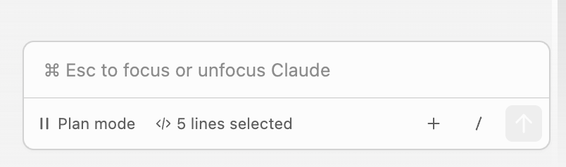
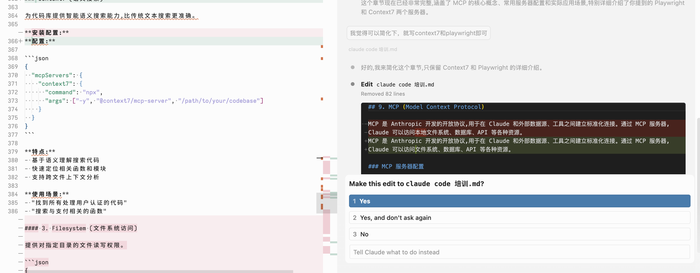
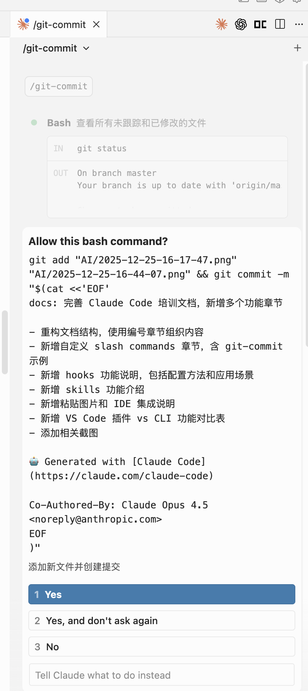
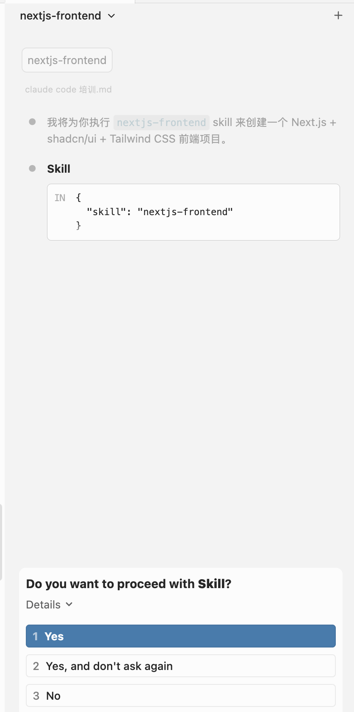
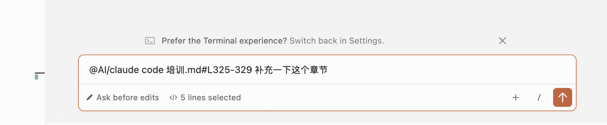

## 1. claude code 安装、基本使用

## 命令行工具安装方法

#### macOS / Linux

**方式一：官方脚本**

```bash
curl -fsSL https://claude.ai/install.sh | bash
```

**方式二：Homebrew (仅 macOS)**

```bash
brew install --cask claude-code
```

#### Windows

```powershell
irm https://claude.ai/install.ps1 | iex
```

#### NPM (跨平台)

```bash
npm install -g @anthropic-ai/claude-code
```
+ claude code 使用三方供应商 → [详细文档](claude%20code%20third%20party.md)
+ claude.md 支持 rules

## 基本使用

plan 模式、自动执行模式、手动执行模式（需要用户确认），可以通过shift + tab切换

plan模式不写代码，你可以让claude给出一个计划后自动执行代码



然后它自带了很多工具，比如编辑代码的，在手动执行模式下，你需要确认代码改动



## 2. CLAUDE.md 记忆系统

CLAUDE.md 是 Claude Code 的**记忆和指令文件**，用于存储项目级、个人级或企业级的指令和上下文信息，让 Claude 记住你的工作流程、编码风格和项目特定的约定。

### 支持的位置（优先级层次）

| 类型 | 位置 | 作用域 | 用途 |
|------|------|-------|------|
| 企业政策 | macOS: `/Library/Application Support/ClaudeCode/CLAUDE.md`<br>Linux: `/etc/claude-code/CLAUDE.md`<br>Windows: `C:\Program Files\ClaudeCode\CLAUDE.md` | 组织全局 | 公司编码标准、安全政策 |
| 项目记忆 | `./CLAUDE.md` 或 `./.claude/CLAUDE.md` | 项目级 | 项目架构、编码标准、工作流程 |
| 项目规则 | `./.claude/rules/*.md` | 项目级 | 模块化的主题特定指令 |
| 用户记忆 | `~/.claude/CLAUDE.md` | 用户全局 | 个人代码风格偏好 |
| 本地项目记忆 | `./CLAUDE.local.md` | 项目级（本地） | 个人的项目特定偏好（自动加入 .gitignore） |

### 基础格式示例

```markdown
# 项目名称

## 语言
请使用中文

## 项目概述
项目的简要说明

## 代码风格指南
- 使用 2 空格缩进
- 驼峰命名法用于变量

## 常用命令
- 构建：`npm run build`
- 测试：`npm run test`
```

### 导入其他文件

使用 `@path/to/import` 语法导入其他文件：

```markdown
项目概述请参考 @README.md

Git 工作流程：@docs/git-instructions.md

个人偏好：@~/.claude/my-preferences.md
```

### 模块化规则系统

对于大型项目，可以使用 `.claude/rules/` 目录组织模块化指令：

```
your-project/
├── .claude/
│   ├── CLAUDE.md           # 主项目指令
│   └── rules/
│       ├── code-style.md   # 代码风格指南
│       ├── testing.md      # 测试规范
│       ├── security.md     # 安全要求
│       └── frontend/
│           └── react.md    # React 特定规则
```

### 路径特定规则

规则可以使用 YAML frontmatter 的 `paths` 字段限制应用范围：

```markdown
---
paths: src/api/**/*.ts
---

# API 开发规则

- 所有 API 端点必须包含输入验证
- 使用标准错误响应格式
```

支持的 glob 模式：

| 模式 | 匹配范围 |
|------|---------|
| `**/*.ts` | 任何目录下的所有 TypeScript 文件 |
| `src/**/*` | `src/` 目录下的所有文件 |
| `*.md` | 项目根目录的 Markdown 文件 |
| `{src,lib}/**/*.ts` | 多个模式匹配 |

### 快速创建

使用内置命令快速创建 CLAUDE.md：

```bash
/init    # 自动生成包含项目信息的 CLAUDE.md
/memory  # 查看已加载的内存文件
```

> **不推荐使用 `/init`**：项目变动快，自动生成的内容很快就会过时，建议手写。

## 3. 自定义 slash commands

给一个例子, 放到 ~/.claude/commands/git-commit.md

```markdown
分析当前的 git 改动并创建提交：

查看改动：

运行 git status 查看所有未跟踪和已修改的文件
运行 git diff 查看具体的代码改动
分析修改的文件，和已经在暂存区的文件
分析改动内容：

识别改动的性质（新功能、修复、重构、文档等）
理解改动的目的和影响范围
确保改动符合项目规范
生成 commit 信息：

遵循项目的 commit 风格（参考最近的 commit 记录）
使用中文编写清晰的 commit message
格式：<type>: <简短描述>
feat: 新功能
fix: 修复bug
refactor: 重构
docs: 文档更新
chore: 构建/工具更新
style: 代码格式调整
perf: 性能优化
执行提交：

将相关文件添加到暂存区
使用生成的 commit message 创建提交
包含 Claude Code 签名
确认结果：

运行 git status 确认提交成功
显示 commit 信息供用户确认
```

然后就只需要运行 /git-commit 就可以了



## 4. hooks

Hooks 是在 Claude Code 执行特定操作时触发的自定义脚本功能，允许用户在工具调用完成后自动执行预定义的命令。

### 配置位置

在 `~/.claude/settings.json` 中配置：

### 示例：任务完成时播放提示音

```json
{
  "hooks": {
    "Stop": [
      {
        "matcher": "",
        "hooks": [
          {
            "type": "command",
            "command": "afplay /path/to/notification.mp3"
          }
        ]
      }
    ]
  }
}
```

### 可用的 Hook 事件

| 事件 | 触发时机 |
|------|---------|
| `Stop` | Claude 停止响应时 |
| `PreToolUse` | 工具调用前 |
| `PostToolUse` | 工具调用后 |
| `Notification` | 发送通知时 |

### 应用场景

- 代码生成完成后播放提示音通知用户
- 在文件修改后自动运行 lint 或格式化
- 执行特定命令后触发自定义脚本

## 4. skills

例子：https://raw.githubusercontent.com/wynemo/my-claude-skills/refs/heads/main/skills/nextjs-frontend/SKILL.md

你只需要在对话中说 nextjs-frontend 或者 “创建 Next.js + shadcn/ui + Tailwind CSS 前端项目，配置静态导出。”，Claude Code 会自动选择对应的skill。



## 5. plugins

Plugins 是扩展 Claude Code 功能的模块，可以包含 slash commands、agents、skills、hooks 和 MCP 服务器配置。

### 插件目录结构

```
plugin-name/
├── .claude-plugin/
│   └── plugin.json      # 插件元数据
├── commands/            # Slash 命令定义
├── agents/              # 专用代理
├── skills/              # 技能定义
├── hooks/               # 事件处理器
├── .mcp.json           # MCP 服务器配置
└── README.md
```

### 官方插件示例：commit-commands

官方仓库：https://github.com/anthropics/claude-code/tree/main/plugins/commit-commands

这个插件提供了三个 Git 工作流自动化命令：

| 命令 | 功能 | 使用场景 |
|------|------|---------|
| `/commit` | 自动分析变更并生成提交信息 | 日常开发提交 |
| `/commit-push-pr` | 一键完成提交、推送、创建 PR | 功能分支完成时 |
| `/clean_gone` | 清理已删除的远程分支 | 定期仓库维护 |

**特性：**
- 自动学习仓库的提交风格
- 遵循 Conventional Commits 规范
- 自动检测并避免提交包含密钥的文件（.env、credentials.json 等）

> 注意：`/commit-push-pr` 命令需要安装 GitHub CLI (`gh`) 并完成认证。

### 其他官方插件

| 插件名 | 功能描述 |
|--------|----------|
| `code-review` | 使用 5 个并行代理进行代码审查 |
| `feature-dev` | 7 阶段结构化功能开发流程 |
| `plugin-dev` | 插件开发工具包 |
| `security-guidance` | 监控 9 种安全模式，防止安全问题 |
| `pr-review-toolkit` | 6 个专门的 PR 审查代理 |

### 安装插件

1. 添加市场：
/plugin marketplace add anthropics/claude-code

2. 安装插件：
/plugin install commit-commands

## 6. 粘贴图片

可以通过以下方式将图片添加到对话中：

- **拖放图片** - 直接将图片拖放到 Claude Code 窗口
- **粘贴图片** - 复制图片后使用 `ctrl+v` 粘贴（注意：不是 `cmd+v`）
- **提供图片路径** - 例如："分析这张图片：/path/to/image.png"

## 7. 与 vscode 集成

选中项目文件、文件若干行，ctrl/command + alt/options +  k，把上下文放到插件中去

这个不管是在插件、命令行里都可以实现

也可以用@文件的方式




## 8. vscode 插件

Claude Code 提供了 VS Code、Cursor 等编辑器插件支持，可以方便地在编辑器中使用。

无需先安装 Claude Code CLI，但部分功能（如 MCP 服务器配置）需要 CLI 支持。

### VS Code 插件 vs Claude Code CLI 功能对比

| 功能 | CLI | VS Code 插件 |
|------|-----|--------------|
| Slash commands | 完整支持 | 部分支持（输入 `/` 查看可用命令） |
| MCP server config | 支持 | 不支持（需通过 CLI 配置后在插件中使用） |
| Checkpoints | 支持 | 即将支持 |
| `!` bash shortcut | 支持 | 不支持 |
| Tab completion | 支持 | 不支持 |

> 如需使用 CLI 专属功能，可以在 VS Code 集成终端中直接运行 `claude` 命令。


## 9. MCP (Model Context Protocol)

MCP 是 Anthropic 开发的开放协议,用于在 Claude 和外部数据源、工具之间建立标准化连接。通过 MCP 服务器,Claude 可以访问文件系统、数据库、API 等各种资源。

### MCP 服务器配置

配置文件位于 `~/.claude/mcp.json`

### Playwright (浏览器自动化)

允许 Claude 控制浏览器进行网页操作、截图、数据提取等。

**配置:**

```json
{
  "mcpServers": {
    "playwright": {
      "command": "npx",
      "args": ["-y", "@executeautomation/playwright-mcp-server"]
    }
  }
}
```

**使用方法:**

在提问时,需要**明确要求使用 Playwright MCP**:

```
"Use playwright mcp to open a browser to example.com"
"使用 playwright mcp 打开浏览器访问 https://example.com 并截图"
"用 playwright mcp 在这个网页上填写登录表单"
```

**使用场景:**
- 自动化网页测试
- 网页截图和数据抓取
- 表单自动填写
- 模拟用户交互

### Context7 (获取最新文档)

Context7 用于获取编程语言、框架和库的最新官方文档,解决 Claude 知识截止日期的限制。

**第一步:配置 MCP 服务器**

编辑 `~/.claude/mcp.json` 文件:

```json
{
  "mcpServers": {
    "context7": {
      "command": "npx",
      "args": ["-y", "@context7/mcp-server"]
    }
  }
}
```

**第二步:使用 Context7**

在提问时,需要**明确要求使用 Context7**:

```
"使用 context7 查询 React 19 有哪些新特性"
"用 context7 查看 Next.js 15 的最新 API"
"通过 context7 了解 Python 3.13 的新功能"
```

或者先告诉 Claude 使用 Context7,再提问:

```
"请使用 context7 获取最新文档"
然后提问: "Tailwind CSS v4 的配置方式是什么?"
```

Claude 会调用 Context7 MCP 服务器从网络获取这些技术的最新官方文档。

**适用场景:**
- 查询最新版本的框架/库特性
- 获取最新 API 文档
- 了解新版本的变更和用法
- 解决 Claude 知识截止日期后的技术问题

### 管理 MCP 服务器

```bash
/mcp list                    # 查看已配置的 MCP 服务器
/mcp restart <server-name>   # 重启 MCP 服务器
/mcp stop <server-name>      # 停止 MCP 服务器
```

### 注意事项

- MCP 服务器在首次使用时会自动启动
- 确保已安装 Node.js (基于 npx 运行)
- Playwright 首次运行会下载浏览器二进制文件