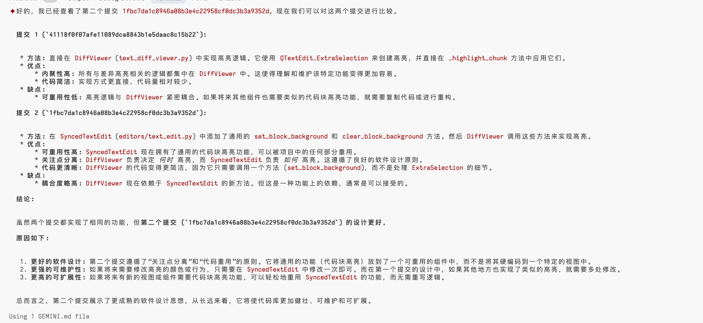

# gemini cli

gemini 也推出了类似 claude code 的功能

也是命令行里直接用

注意可能要使用这个环境变量来登录

export GOOGLE_CLOUD_PROJECT=xxx

可以用 google cloud 那边创建一个 project

## 善用 git worktree 

这么多 agent，claude code，gemini，还有网页上的 jules

为他们各自弄一个 git worktree 这样来并行开发

也可以并行做各种事情

然后比较

甚至可以让 各种 agent 做同样的任务

最后你看我让 AI 自己评判同行与自己的代码

