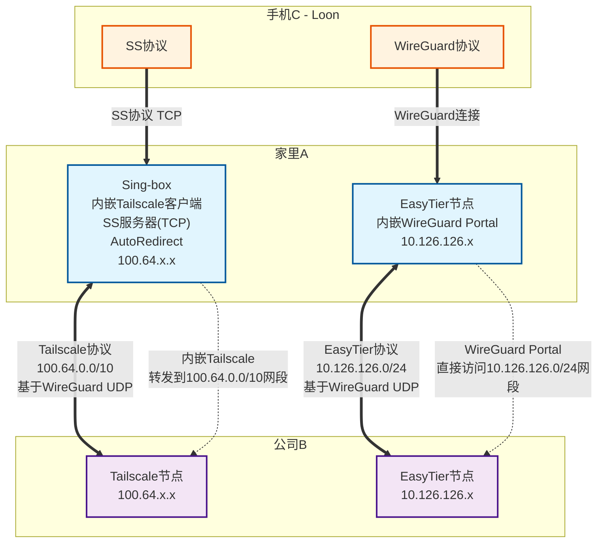

大家可能用过 zerotier、tailscale 等内网穿透的应用，它们都是需要服务供应商的服务器的

今天给大家介绍 easytier，完全可以自己搭建，不需依赖其他服务器

同时，就算使用公共服务器组网，也是在国内的，这样但 zerotier、tailscale 无法连上时，easytiter 可以作为一个备份

easytier 组网非常简单，下一个包 里面有 easytier-core easytier-cli
其中前面一个用于组网，后面一个用于查看连接状态

## 公共服务器组网

最简单，可以输入网络名称、网络密码，-d 表示使用 dhcp，默认为会分配 10.126.126.x 这个网段，-p 后面跟公共节点

sudo ./easytier-core -d --network-name your_networkname --network-secret your_password -p tcp://public.easytier.cn:11010

相应的，其他节点，也做同样的事情

easytier-cli

如果想分享节点所在的局域网出去 可以用 -n 参数，后面跟一个子网网段，比如

sudo ./easytier-core -d --network-name your_networkname --network-secret your_password -p tcp://public.easytier.cn:11010 -n 192.168.0.0/24

这样，其他节点就可以访问这个子网了

## 点对点组网

点对点组网，就是可以不用公共服务器，两个或者多个节点，只要有一个节点有公网 IP，就可以把网组起来

但其实点对点组网，可以混搭公共服务器组网，这样比较灵活

举个例子，国外的节点有可能连不上公共服务器（因为在国内），这时候就可以让它连其他有公网 IP 节点

## 代理局域网

每个节点都可以代理局域网，这样其他节点可以访问

## wireguard portal

在 easytier 网络的任意节点，可以创建一个 wireguard portal，当然这个节点需要一个公网 IP

这样手机，比如 ios，就可以通过这个节点直接访问 easytier 的 vpn 网络，也包括前面的说的代理的局域网

oracle:
sudo ./easytier-core -d --network-name your_networkname --network-secret your_password -p udp://your_peer_ip:11010

home:
sudo ./easytier-core -d --network-name your_networkname --network-secret your_password -p tcp://public.easytier.cn:11010 -n 192.168.0.0/24 --vpn-portal wg://0.0.0.0:11013/10.14.14.0/24

company:
sudo ./easytier-core -d --network-name your_networkname --network-secret your_password -p tcp://public.easytier.cn:11010

下图也可以简化下，可以去掉 loon 与家里的 wiregurad，让 sing-box 转发下 10.126.126.x 的流量

