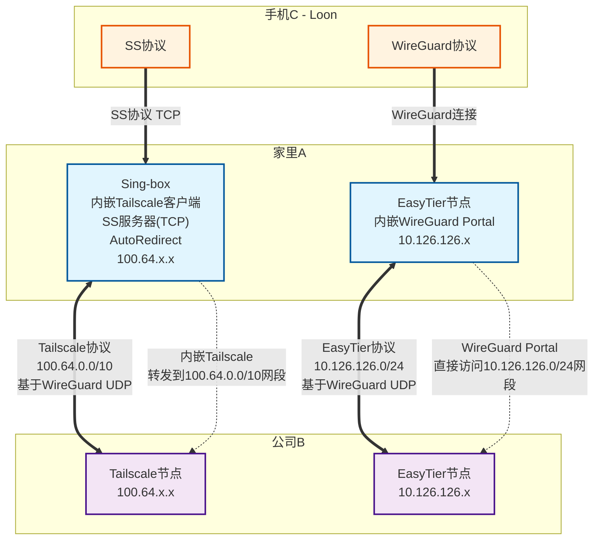

oracle:
sudo ./easytier-core -d --network-name lozhang123 --network-secret fuckcdc -p udp://home.dabin.info:11010

home:
sudo ./easytier-core -d --network-name lozhang123 --network-secret fuckcdc -p tcp://public.easytier.cn:11010 -n 192.168.0.0/24 --vpn-portal wg://0.0.0.0:11013/10.14.14.0/24

company:
sudo ./easytier-core -d --network-name lozhang123 --network-secret fuckcdc -p tcp://public.easytier.cn:11010

下图也可以简化下，可以去掉 loon 与家里的 wiregurad，让 sing-box 转发下 10.126.126.x 的流量

