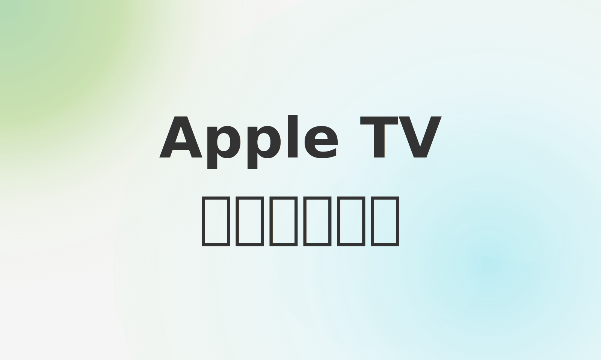

首先确认下你apple tv的型号

目前支持旁路由的就两款 Apple TV 机型

2021 款Apple TV 4K 

32gb 与 64gb都是支持的

2022 款Apple TV128GB 版本也支持

2022 Apple TV 64GB 版本以及其他型号没有 Thread 网络，并不支持旁路由

确认你apple tv上的icloud账户与mac/iphone上是同一个

然后在设置 - 隔空投放和HomeKit - HomeKit 这里设置一个房间

如果你发现apple tv作为软路由有问题，可以试试登出默认账户，重新设置

然后 iphone，ipad，mac 家庭 app 里看到是： apple tv 为 家居中枢

这里找到living room

点击设置

可以看到apple tv确实作为家居中枢了（home hub）

如果你有homepod 之类的，ios 18已经能手动选择apple tv作为家居中枢

之前的版本是有可能某些情况homepod变为家庭中枢的

影响apple tv作为软路由

然后我们可以把apple TV设置为固定IP 

用dhcp的话IP可能会变动

打开apple tv上的vpn

这里shadowrocket，singbox，surge，loon 之类的vpn都可以

客户端这边设置apple tv的IP作为网关

 dns可以设置为114.114.114.114 

点击确认

测试下科学上网的效果

打开豆瓣与谷歌

最后说下，apple tv上小火箭可以设置劫持dns 114.114.114.114:53

与前面设置的114.114.114.114一致

也可以在客户端把dns设置为198.19.0.2

这个性能不怎么样 https://www.right.com.cn/forum/thread-8308061-1-1.html
