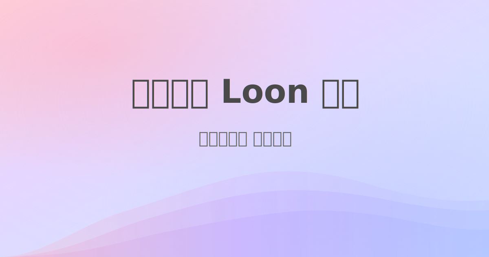

今天来给大家讲一个代理软件loon

[](https://youtu.be/luQjFLs7Reg)

## 购买

loon是付费软件，国区没有
定价7.99美元，大概一顿kfc
需要购买的朋友可以去亚马逊买苹果美区礼品卡 不过要信用卡
或者去 https://shop.pockyt.io/pc/brands/all 可以用支付宝买苹果美区礼品卡


## 配置文件
拿到软件后 有个默认配置文件

这是它的概念：

proxy - 本地节点

remote proxy - 订阅节点集合，也就可以sub-store导入

proxy chain - 代理链

proxy group - 策略组

remote filter - 过滤节点集合 就是通过名字，区分国家、地区的节点

但有个问题是它只支持一个配置文件，而其他代理工具一般支持多个配置文件

## 界面支持

所有操作都支持界面，不用写配置文件，比如支持在界面上添加节点，策略组，代理链

## 分流

我们依然可以使用 `blackmatrix7/ios_rule_script` 的规则

示例:

```
[Remote Rule]
https://raw.githubusercontent.com/blackmatrix7/ios_rule_script/refs/heads/master/rule/Loon/OpenAI/OpenAI.list, policy=openai, enabled=true
https://raw.githubusercontent.com/Loon0x00/LoonLiteRules/main/proxy/YouTube.list, policy=YouTube, tag=YouTube, enabled=true
https://raw.githubusercontent.com/blackmatrix7/ios_rule_script/refs/heads/master/rule/Loon/Google/Google.list, policy=Google, tag=Google, enabled=true
https://raw.githubusercontent.com/Loon0x00/LoonLiteRules/main/proxy/Telegram.list, policy=Telegram, tag=Telegram, enabled=true
https://raw.githubusercontent.com/blackmatrix7/ios_rule_script/master/rule/Loon/Proxy/Proxy.list, policy=Available, tag=Global, enabled=true
https://raw.githubusercontent.com/Loon0x00/LoonLiteRules/main/direct/cn.list, policy=DIRECT, tag=GEOIP_CN, enabled=true
```

注意下 policy 字段即可，表示用哪个策略组

## 测速
测速后没有排序，也不会显示绿色/黄色/红色，

bestsub的作用就体现出来了，测试可用性，排序，加测速测测出来的速度

bestsub介绍可以看往期视频介绍

## 代理链
[Proxy Chain]
speed_chain = 中转,落地, udp=true

顾名思义，落地节点通过中转节点代理

还可以添加多个中转节点，比如：A，B，C，这样就形成一个代理链，依次通过A，B，最后C落地

不能选择订阅节点集合(remote proxy)、过滤节点集合(remote filter)，只能选择本地节点(proxy)或者策略组(proxy group)

## macos

可以一样像小火箭、surge那样做软路由，但注意要用网线，比如macmini拿来做软路由

## 支持的协议

更新比较勤快，当然协议支持还是没有小火箭多

2024年年底支持了ss2022：2022-blake3-aes-256-gcm

2025 4月支持了 vless + relality

2025 5月为止 还是没有支持grpc

## 抓包

在首页那里 点击编辑 把“抓包记录”弄出来

然后打开mitm，安装证书，让系统信任

## 插件

loon的插件很丰富，很多去广告的插件

这算是它的特色吧

可以看

[可莉的Loon资源库 | 插件 | 脚本 | 规则](https://github.com/luestr/ProxyResource)

我用 [YouTube去广告](https://www.nsloon.com/openloon/import?plugin=https://kelee.one/Tool/Loon/Plugin/YouTube_remove_ads.plugin) 插件

再比如：sub-store boxjs 这两个功能插件，这里就不详细介绍

boxjs之前讲过，详见 [小火箭 + boxjs + 小组件](<./shadowrocket/iphone 用scripttable小组件显示网上国网、联通余量 - 使用小火箭（shadowrocket）.md>)

记得把mitm打开，安装证书， 脚本（script）、复写（rewrite）这些开关都打开

## 同步
profile - settings - icloud drive

这里如果有冲突，可以选择本地覆盖icloud，或者让icloud覆盖本地

然后如果是新设备，从icloud获得的配置，里面的证书，需要手动安装证书，让系统信任

## 日志
设置 - 调试 - 日志 这里可以查看日志

## apple tv
这里可以把配置共享给apple tv上的loon

## 银行app以及国网app检测 vpn

loon 设置--高级设置--代理模式--tun only，银行 app 就不提示了