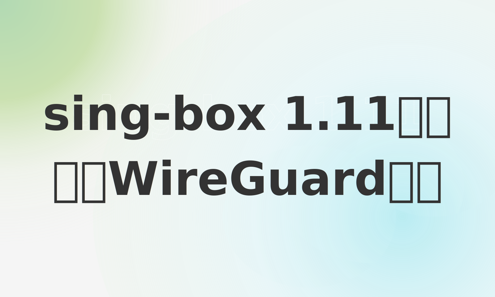

[](https://youtu.be/Dv5jrp8shRg)

大家好，今天来给大家讲sing-box使用wireguard

我们会用一台debian服务器，一台iphone来做演示

sing-box 这里我们使用1.11.4版本
```
pi@raspberrypi:~$ ./sing-box version
sing-box version 1.11.4
```
iphone上也是这个版本

自从1.11版本，wireguard在sing-box里作为了endpoint存在
之前是作为出站存在
就是说既可以做入站，也可以做出站

我们在服务器上，安装wireguard

安装wireguard
`sudo apt update && sudo apt install wireguard`

这样用可以用它提供的wg命令生成公私钥


首先生成两对公私钥：
```bash
wg genkey | tee privatekey | wg pubkey > publickey
wg genkey | tee client_privatekey | wg pubkey > client_publickey
```

这是服务器sing-box的配置
```json
"endpoints":[
{
  "type": "wireguard",
  "tag": "wg-ep",

  "system": true,

  "mtu": 1408,
  "address": ["10.18.0.1/24"],
  "private_key": "QFnR4J5KPnvHSTsDef6RkleJeunIKbL8eUIizH8eaV4=",
  "listen_port": 51820,
  "peers": [
    {
      "public_key": "mBDwmBFjS1/mpHZFSHhXrdwzVOUgLsSClGx7ROU+wQo=",
      "allowed_ips": ["10.18.0.2/32"]
    }
  ]
}
],
```

iphone 手机上 sing-box 的配置：
```json
  "endpoints":[
{
  "type": "wireguard",
  "tag": "wg-ep",
  "system": false,
  "mtu": 1408,
  "address": ["10.18.0.2/24"],
  "private_key": "uGEr5DAjfyoVg57/XsRx6Vy05CCctX+fNRs0i2GVWms=",
  "peers": [
    {
      "address": "服务器外部IP地址",
      "port": 51820,
      "public_key": "Gi8qcDsHGhndINjk23wa89GG690JXv5bf46toUCpgzo=",
      "allowed_ips": ["0.0.0.0/0"],
      "persistent_keepalive_interval": 25
    }
  ]
}
```

这里 服务器外部IP地址 可以填你的公网地址，然后路由器上端口映射到你的服务器上
或者可以是ipv6地址

同时需要加上路由规则：

```json
"route": {
   "rules": [
     {
       "action": "route",
       "ip_cidr": "10.18.0.0/24",
       "outbound": "wg-ep"
     },
     {
       "action": "route",
       "ip_cidr": "192.168.0.0/24",
       "outbound": "wg-ep"
     }
   ]
}
```

服务器 singbox 配置： [sing-box-wiregurad_server.json](sing-box-wiregurad_server.json)

iphone singbox 配置： [sing-box-wiregurad_ios.json](sing-box-wiregurad_ios.json)

25年5月4日edit：

有群友问，通过singbox的wireguard连接到路由器例如OpenWRT的wireguard从而实现科学上网

可以弄，iphone里outbounds配置wg-ep

```json
{
  "type": "selector",
  "tag": "proxy",
  "outbounds": [
    "direct",
    "block",
    "自动选择",
    "local-hy2",
    "US-cloudflare-RNCustom-群友4",
    "KR,群友1",
    "KR,群友2",
    "KR,群友3",
    "wg-ep"
  ],
  "default": "自动选择"
}
```

wireguard 手机mtu 改小一点 1384

不然会出现报错，message too long
