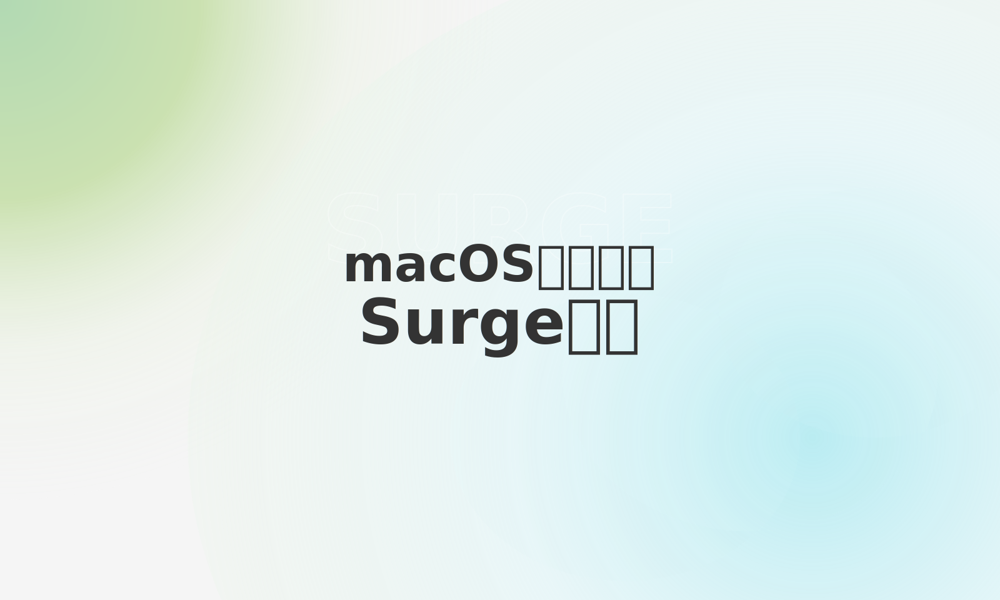

# macos 代理 工具 surge 介绍

大家好
surge 是 macos 上的老牌代理软件了 有很久的历史了，今天从这几个方面讲下它：

视频讲解：
[](https://www.youtube.com/watch?v=SUEnZ9LnpW4)

### 添加机场配置

首先是导入机场配置，
打开主界面 - more - profile（配置）- Install from URL... - 填入机场订阅

### surge 规则

常用的是这两个
DOMAIN-SET 域名列表
RULE-SET 规则集

以下是两个 surge 的规则集的仓库

比如 https://github.com/Loyalsoldier/surge-rules 这个仓库的域名列表：https://cdn.jsdelivr.net/gh/Loyalsoldier/surge-rules@release/direct.txt

比如 https://github.com/blackmatrix7/ios_rule_script/tree/master/rule/Surge 这个仓库的规则集：https://github.com/blackmatrix7/ios_rule_script/raw/refs/heads/master/rule/Loon/OpenAI/OpenAI.list

### 手搓配置

主界面 - more - profile（配置）- new profile（新建一个空配置）

把我写好的一个最小配置粘贴进来

```
[Proxy]
# 这里填写节点

[Proxy Group]
# 策略组
your_proxy_provider = select, policy-path=http://192.168.0.105:3001/yanshiyong/download/bywave?target=Surge, update-interval=0, hidden=1
PROXY = select, include-other-group="your_proxy_provider"

[Rule]
DOMAIN-SET,https://cdn.jsdelivr.net/gh/Loyalsoldier/surge-rules@release/proxy.txt,PROXY
DOMAIN-SET,https://cdn.jsdelivr.net/gh/Loyalsoldier/surge-rules@release/direct.txt,DIRECT
GEOIP,CN,DIRECT,no-resolve
FINAL,PROXY
```
打开界面就可以看到节点信息了
主界面上也能看到相应的信息

我们这使用 surge-rules https://github.com/Loyalsoldier/surge-rules 这个仓库
添加一个代理的，一个直连的 domain-set
接着是 geoip，中国的 IP 走直连
geoip cn 这里，加上 no-resolve，表示不解析域名，好处是不会 dns 污染，坏处是国内小众网站会慢，所以用这个的话，前面的直连规则尽量多点
最后 final，兜底的走代理

### 界面添加配置/手动添加节点
surge 非常完善，和小火箭 (shadowrocket) 一样，不需要了解配置文件，所以你也可以直接在界面上配置
打开主界面
在 Policy（策略）这里，Proxy 可手动添加节点
Proxy Group（策略组），这里可以添加机场订阅的策略组
在 Rule 这里，添加规则，也是按从上到下这样匹配规则的，所以尽量把 IP 的规则放后面，域名的放前面，自己注意下拖动调整先后顺序

### 使用模版

直接从 小火箭 shadowrocket 那边取来的，稍微修改了下，放到我的 github 仓库了 [surge_template.conf](surge_template.conf)

有需要的朋友自己可以使用，增加自己的节点，规则，填入自己的机场订阅

IP-CIDR6 这和小火箭不一样，表示 ipv6

### 增强模式

增强模式会接管系统所有流量，不光是浏览器

用 surge 增强模式 记得把 chrome 的 doh 关掉 因为 surge 会设置 dns 为 1.0.0.1 chrome 就会用在这个 chrome.clouflare-dns.com 这个是 cloudflare 的 dns

这样 chrome 这边自己把有些域名解析为 IP

那样的话 分流极有可能走到 final 达不到预期的分流效果


不过也可以在规则里用协议嗅探来规避

DOMAIN、DOMAIN-SUFFIX、DOMAIN-KEYWORD 规则添加了一个名为 extended-matching 的可选参数。启用此参数后，规则将尝试同时匹配 SNI 和 HTTP 主机头（或 :authority）。

即使浏览器发到加密的 dns surge 也可以协议嗅探，匹配域名

### 代理链

策略（Proxy Policy）策略组（Policy Group）

underlying-proxy：使用其他代理去连接此代理，即代理链。也就是 underlying-proxy 跟中转节点。中转节点可以是另一个代理策略，也可以是策略组。

举例：

+ 这是策略，用另外一个策略作为中转节点，也可以用策略组作为代理
```
wireguard-home = wireguard, section-name = Home
ProxySOCKS5 = socks5, 10.1.0.2, 7890, underlying-proxy = wireguard-home
```

+ 这是策略组，也可以用另外一个策略组作为中转节点，但是要用这个关键字 external-policy-modifier
```
SOCKS5 = select, policy-path=https://sub.store/download/socks5, external-policy-modifier='underlying-proxy="CF Trojan"'
CF Trojan = select, policy-path=https://sub.store/download/cf-trojan, hidden=1
```

### 抓包

应该说 mitm 配合模块/脚本用的，给某些域名配置好 mitm，控制台打开 mitm，控制台界面上只能看相应的域名的 request/response header;

然后 http 抓包，默认配置匹配所有域名（会忽略上面 mitm 配置的域名）, 解密所有流量（这样会有问题，有些应用比如 python 就会报错，应该是没用这个信任的证书），但也可以让它不覆盖 mitm 的配置（关掉 Turn on MITM Automatically），就只解密 mitm 那边配置的域名。

所以懒的话，用默认配置，直接打开 http capture 就解密了，但不推荐这样做

观众答疑：视频 13:21 有说抓包后，直接界面可以看 response body, response header 等信息；然后存到硬盘的目录的抓的包，比如这个文件夹/var/folders/89/d29rn0113c7f4v6dsr8rs9kr0000gn/T/Surge Catpure/2025-06-05-235412，里面有抓的站点子目录，里面会有个model.json 与 response.dump，注意看下 model.json,  看是否有压缩，比如 Content-Encoding: br 就是表示 response.dump 是 br 格式，你要用相应工具解压

### surge 与其他软件对比

surge 确实好用 工程质量很高

+ 小火箭、，分组那块。。。。分组里偶尔出现奇怪的不存在的代理，界面交互有些地方不方便，比如链式代理时没有测过的速了; 选分组没那么便捷，毕竟是一款手机软件
+ stash  分组有时候有 bug 没有正确分组              - sub store 忠实玩家，因为我界面上不能加节点啊
+ mihomo party 又感觉太重 非原生应用  加节点也不方便  - sub store 忠实玩家，同上
+ karing 太卡 切换一个节点 界面卡几秒。。。

### 懒人配置模版

一般机场都可以提供 surge 的配置的

当然也可以使用这个仓库 https://github.com/cc63/Surge/tree/main/Conf 填下策略组的地址
